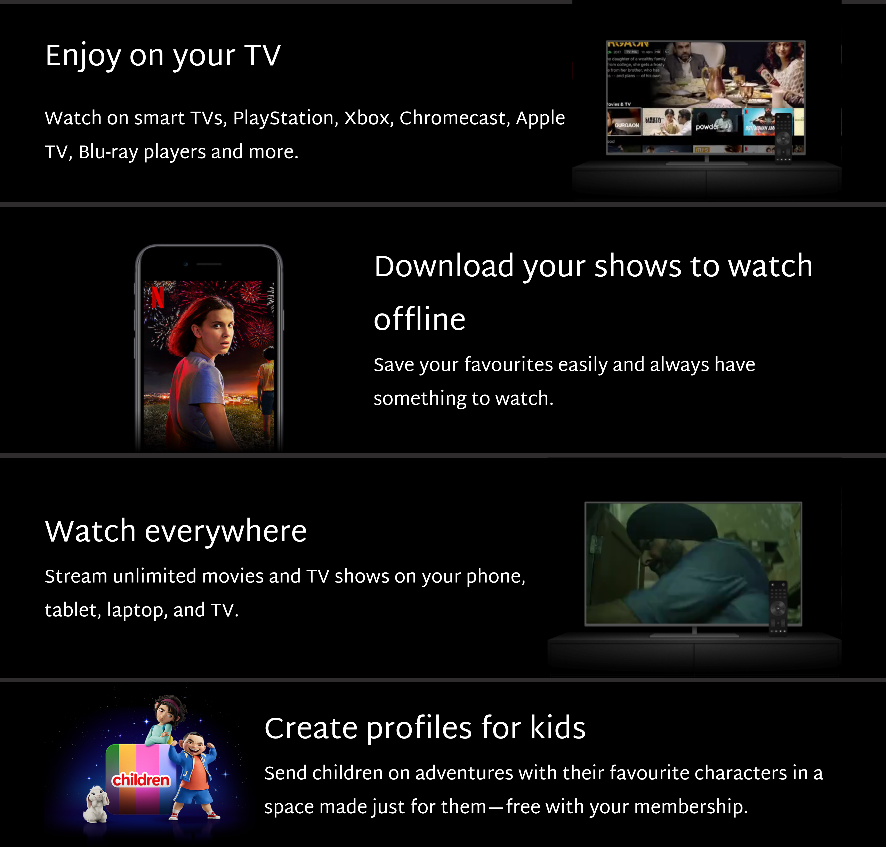
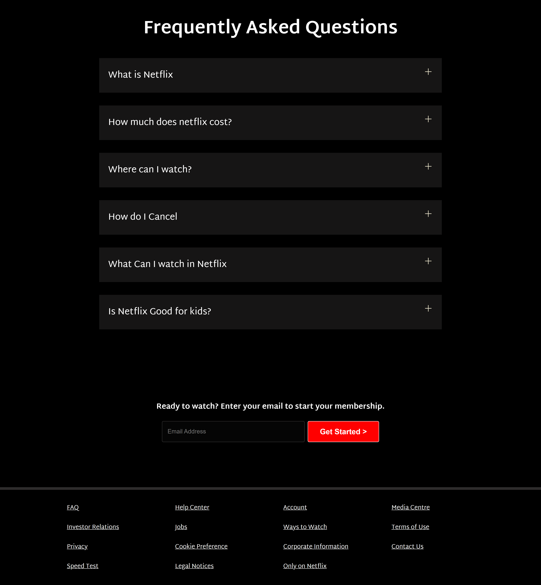
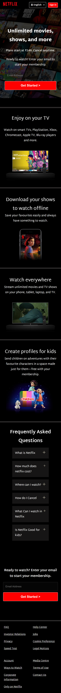
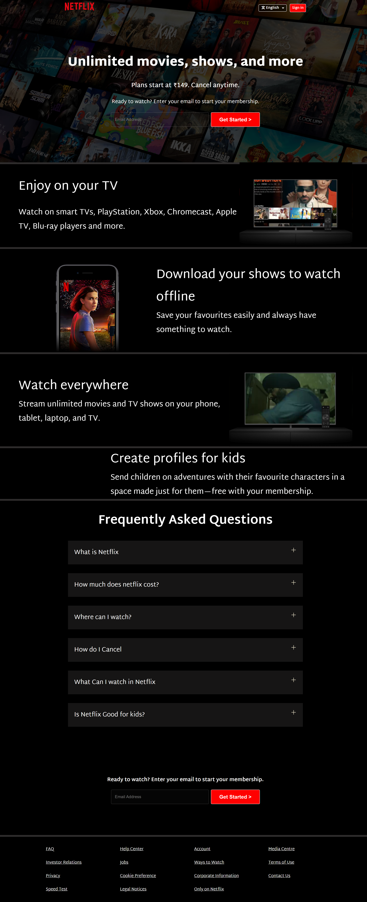

# Netflix Clone

A responsive, high-fidelity Netflix landing page clone built with pure HTML5 and CSS3.
Live🔗: clever-sprite-886044.netlify.app

---

## 📸 Screenshots & Previews

### 1. Hero & Navigation
> Dynamic navigation bar with language selector, sign-in button, and membership email call-to-action overlay.


---

### 2. Feature Sections
> Showcase sections highlighting streaming on TV, offline downloads, cross-device support, and kids profiles.



---

### 3. FAQ & Footer
> Interactive FAQ accordion layout with hover transitions and global footer links.



---

### 4. Mobile Responsive Layout
> Optimized for mobile and small-screen devices with stacked responsive layouts.

<p align="center">
  
</p>

---

### 5. Full Page Overview
> Complete landing page view from top to bottom.



---

## ✨ Features

- **Netflix-Style Hero Section**: High-resolution background collage with dark gradient overlay and call-to-action input.
- **Interactive Language Selector**: Dropdown supporting English, Hindi, and Telugu.
- **Media Feature Rows**: Alternating content blocks featuring embedded video frames, graphics, and animations.
- **FAQ Accordion**: Clean questions section with expandable styling and hover micro-interactions.
- **Fully Responsive**: Adapts seamlessly to mobile, tablet, laptop, and 4K desktop screens.

---

## 🛠️ Tech Stack

- **HTML5**: Semantic markup structure
- **CSS3**: Flexbox, CSS Grid, media queries, custom variables, and responsive typography

---

## 🚀 Getting Started

### Run Locally
1. Clone this repository:
   ```bash
   git clone https://github.com/satvikreddy82/Netflix-Clone.git
   ```
2. Navigate to the project directory:
   ```bash
   cd Netflix-Clone
   ```
3. Open `index.html` in your web browser:
   - Double-click `index.html`, or
   - Use Live Server in VS Code, or
   - Run a simple local server:
     ```bash
     python -m http.server 8000
     ```

No external build tools, package managers, or dependencies are required.
